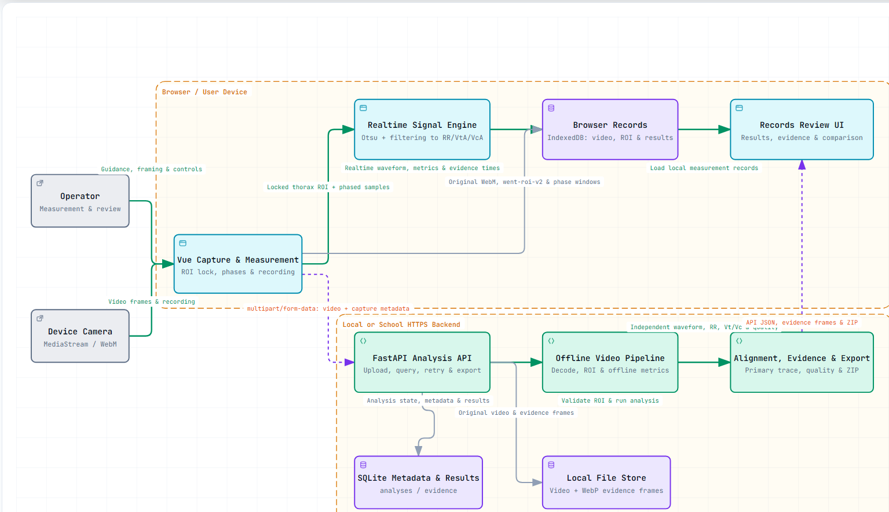

# WenT

**A web research platform for measuring respiratory movement from lateral 2D video.**


## Research motivation and objectives

The reference study investigates whether an ordinary camera can provide a simple, non-contact approach to observing respiratory motion, including a possible future option for people who have difficulty using a spirometer [1]. The physical observation is that breathing changes the anterior-posterior extent of the upper body. A lateral camera view makes this front-to-back motion visible as a changing silhouette. Segmenting that silhouette over time produces an image-area waveform that can be examined alongside a volume-time spirogram.

WenT turns this research procedure into an inspectable software workflow. The project has four objectives:

1. **Guide repeatable data collection:** explain the side-on posture, define a thorax region of interest (ROI), and record the breathing phases and their actual timestamps.
2. **Extract respiratory movement:** convert camera frames into a silhouette or contour signal and estimate normal-breathing amplitude, maximum-manoeuvre amplitude and respiratory rate.
3. **Support methodological comparison:** retain separate Realtime and Offline results, expose their alignment and disagreement, and link waveform landmarks to source frames.
4. **Support reproducible analysis:** preserve the available recording, ROI, segmentation settings, samples, quality reasons and exports so another researcher can examine how a result was obtained.

These are software and measurement-method objectives. Comparing the two software paths assesses consistency between implementations; comparison against a suitably controlled reference measurement is still required to establish physiological accuracy.

## What Vt and Vc mean

The physiological definitions follow respiratory measurement terminology [2]. The superscript **A** distinguishes an image-area quantity from a measured air volume.

| Symbol | Meaning | Quantity and unit | Role in WenT |
| --- | --- | --- | --- |
| Vt, conventionally V_T | **Tidal volume :** the air volume inhaled or exhaled during an ordinary breathing cycle. | Gas volume, usually L or mL. | The physiological quantity motivating the normal-breathing analysis. |
| Vc, conventionally VC | **Vital capacity :** the volume change between full inspiration and full expiration, measured at the mouth. | Gas volume, usually L or mL. | The physiological quantity motivating the maximum-inhale and maximum-exhale analysis. |
| Vt^A | Image-derived tidal amplitude: the characteristic change in the silhouette signal during normal breathing. | Pixel-area proxy. | Shown as `VtA` where used in the UI; stored as frontend `vtPx` and backend `vt_px`. |
| Vc^A | Image-derived vital amplitude: the difference between supported maximum-inhale and maximum-exhale signal levels. | Pixel-area proxy. | Shown as `VcA` where used in the UI; stored as frontend `vcPx` and backend `vc_px`. |
| R_A = Vc^A / Vt^A | Ratio of maximum-manoeuvre amplitude to normal-breathing amplitude. | Dimensionless. | Stored as `ratio`; available only when both proxy estimates pass the implemented quality checks. |
| RR | Respiratory rate estimated from the normal-breathing signal. | Breaths per minute. | Computed separately by the two analysis paths. |


The `Px`/`_px` field names refer to image-derived area or area-equivalent values: a count of foreground pixels or a sum of contour widths across rows. They do not represent litres, millilitres or calibrated physical chest area. A dimensionless amplitude ratio permits a relative comparison under a stable measurement setup, but does not establish that the image signal is proportional to air volume. Changes in posture, camera distance, clothing or segmentation can also change the ratio.

## Reference method and implementation

The following concepts are taken from the supplied reference manuscript, particularly Section 3, Figures 2-6 and Equations (1)-(4) [1]. They explain why the project uses a side-view camera and what the waveform represents.

| Research concept | Meaning in the reference method | Connection to WenT |
| --- | --- | --- |
| **Lateral 2D view** | Observe upper-body motion with a camera placed to the side. | The Guide and Position stages establish the side-on view and thorax ROI. |
| **Anterior-posterior motion** | Breathing changes the front-to-back extent of the upper body. | Silhouette and anterior-contour changes supply the movement signal. Anatomical front-to-back direction is distinct from the image coordinate labels. |
| **Maximum inhalation and exhalation** | Identify the range of silhouette change during the maximum manoeuvre. | Named capture phases constrain the search for Vc^A and its evidence frames. |
| **Grayscale image f_t(i,j)** | Represent each video frame by intensity; i is horizontal position, j is vertical position and t denotes time/frame. | The browser and backend convert the selected image region to grayscale. |
| **Binary thresholding / Otsu reference** | Separate the body from the background using an intensity threshold. | WenT uses a calibrated threshold when available, with Otsu-based estimation as a fallback, and handles dark or light foreground polarity. |
| **Body area A_t** | Count foreground pixels in each frame to obtain a temporal area signal. | WenT retains an area or contour-derived signal with timestamps and quality information. |

For the reference study's light foreground on a dark background, the binary mask and area are:

$$
B_t(i,j)=\begin{cases}1,&f_t(i,j)>\tau,\\0,&\text{otherwise},\end{cases}
\qquad
A_t=\sum_{i=0}^{I-1}\sum_{j=0}^{J-1}B_t(i,j).
$$

Here, $\tau$ is the segmentation threshold and $I$ and $J$ are the image-region width and height. The reference experiment used white T-shirts, a black background and a camera distance of 1 m to simplify segmentation [1]. Those conditions describe that experiment; they are not evidence that arbitrary lighting, clothing or camera setups have been validated in WenT.

The manuscript's amplitude definitions are:

$$
V_t^A=\frac{1}{N}\sum_{k=1}^{N}\left(a_k^{\max}-a_k^{\min}\right),
\qquad
V_c^A=A_{\max}-A_{\min},
\qquad
R_A=\frac{V_c^A}{V_t^A}.
$$

$N$ is the number of selected normal breaths; $a_k^{\max}$ and $a_k^{\min}$ are their local area extrema. The manuscript compares the image ratio $R_A$ with the corresponding spirometry ratio because the underlying measurements have different units [1].


## Experimental workflow

The operator reviews six visual Guide steps, opens Position, frames the side-view upper body and locks the normalized `went-roi-v2` ROI. The application then runs this nominal **37-second** sequence:

| Phase | Duration | Purpose |
| --- | --- | --- |
| Ready | 3 s | Establish the start of the recorded sequence. |
| Normal breathing | 12 s | Collect ordinary breathing cycles for Vt^A and RR. |
| Prepare to inhale | 3 s | Give the next manoeuvre instruction. |
| Full inhale | 8 s | Observe expansion towards the supported inhale level. |
| Prepare to exhale | 3 s | Give the next manoeuvre instruction and retain the post-inhale level. |
| Slow exhale | 8 s | Observe contraction towards the supported exhale level. |


## System architecture



| Path | Execution | Input | Retained output |
| --- | --- | --- | --- |
| Realtime | Vue browser application | Live frames in the locked thorax ROI | Area/contour waveform, `vtPx`, `vcPx`, RR and quality reasons. |
| Offline | FastAPI, OpenCV and SciPy | Independently decoded saved video and capture contract | Row-profile waveform, `vt_px`, `vc_px`, RR, quality and landmarks. |
| Primary | Review layer | Aligned, scaled Realtime and Offline samples | Display trace for comparing timing and waveform shape. |

The backend first attempts OpenCV decoding and uses the FFmpeg executable provided by `imageio-ffmpeg` when needed for browser recordings. The architecture source is [WenT_Architecture_EN.architecture.json](docs/architecture/WenT_Architecture_EN.architecture.json).

## Prerequisites on Windows macOS and Linux

The frontend and backend can be prepared on Windows, macOS or Linux. The recorded handover verification was performed on Windows; the instructions below provide installation routes for other platforms, whose camera, codec and complete-workflow acceptance must be checked separately. Phones and tablets can be capture clients for a hosted application; they are not required to run the Python/Node development environment.

| Prerequisite | Selected version or requirement | Purpose |
| --- | --- | --- |
| Git | A current platform package. | Obtain and identify the source revision. |
| Python | **3.12 recommended**; the backend declares `>=3.11`. | Run FastAPI and the analysis packages in a project virtual environment. |
| Node.js and npm | **Node.js 24 LTS** with its bundled npm. | Install the locked frontend dependencies and run Vite. |
| Browser | A browser with camera and MediaRecorder support for the chosen workflow. | Run the capture/review client; verify the actual browser/device combination. |
| Camera and network | Camera permission for live capture; internet access for initial package downloads. | Record the experiment and install dependencies. |

### Check the existing environment before installing

Start with an inventory on every computer, including computers that already have developer tools. Record the OS and CPU architecture, installed versions and executable paths. Run the checks for the chosen OS below; an unavailable command identifies a missing component and does not prevent checking the remaining tools.

**Windows PowerShell:**

```powershell
Get-Command -Name git, py, python, node, npm -All -ErrorAction SilentlyContinue
git --version
py -0p
node --version
npm.cmd --version
```

`py -0p` lists interpreters known to the traditional Python launcher. If that launcher is absent, inspect the installed Python through its verified executable path using the selection steps below.

**macOS / Linux Terminal:**

```bash
uname -sm
command -v git python3 python3.12 node npm
git --version
python3 --version
python3.12 --version
node --version
npm --version
```

Choose the action for each component independently:

| Component and detected state | Action |
| --- | --- |
| Git is installed and can obtain the source | Reuse it. This project declares no particular Git minimum version. Authentication/network failures need their own resolution. |
| Git is missing | Install the OS package described below; an authorized source ZIP is also usable if its revision is recorded. |
| Python is missing or below 3.11 | Install a separate Python 3.12 runtime for WenT, then create its project virtual environment. |
| Python 3.11 or 3.12 is installed | It meets the backend's declared floor; select the intended interpreter explicitly. Python 3.12 is the recommended version family. |
| Python 3.13 or newer is installed | It meets the declared floor, but that alone establishes neither dependency-wheel availability nor verification on that version. A separate Python 3.12 runtime provides the documented setup route. |
| Node/npm is missing, outdated or resolves to an unintended installation | Follow the Node selection section below; use the npm bundled with the selected Node runtime. |
| A `.venv` or `node_modules` already exists | Check its runtime and origin. Rebuild dependencies after changing runtime, OS, architecture or moving the project, as described below. |
| The browser or video decoder is unavailable | Complete the browser/decoder readiness checks below before a capture-to-analysis run. |

Retain runtimes required by other projects and select WenT's runtime through an explicit interpreter path or a version manager. On macOS/Linux, keep the OS-managed Python intact. A Python version manager selects the base interpreter; `.venv` isolates this project's Python packages. Node selection and frontend dependency installation are likewise separate steps.

Use packages matching the computer's architecture, such as Apple Silicon/ARM64 or Intel/x64. The historical backend test used Python 3.12.14, and a frontend build used Node.js 24.19.0. Installing a different patch release is a new environment that must be recorded and checked. Python 3.12.10 is the last 3.12 release with official Windows/macOS binary installers; later 3.12 security releases are source-only [Python release information](https://www.python.org/downloads/release/python-31214/).

### Windows

For components identified as missing or unsuitable, use [Git for Windows](https://git-scm.com/install/windows), the appropriate [Python 3.12.10 installer](https://www.python.org/downloads/release/python-31210/) and [Node.js 24 LTS](https://nodejs.org/en/download). Enable the Python launcher and the installer's PATH option. Node's installer includes npm. Close and reopen PowerShell and the IDE after installation, then check:

```powershell
git --version
py -3.12 --version
node --version
npm.cmd --version
Get-Command git, py, node, npm
```

If `py` is unavailable, use the installed Python executable after verifying its version, or repair the launcher installation. Use the same verified interpreter to create the project environment.

Without administrator privileges, the [full Python installer supports a per-user installation](https://docs.python.org/3.12/using/windows.html#the-full-installer); select the current-user route and pip/venv support. [Portable Git](https://git-scm.com/install/windows) can be extracted into a user-owned folder and run through its `cmd/git.exe`. Node's user-owned ZIP route is documented below. Follow the computer's software policy. The Python embeddable ZIP serves a different purpose from the development installer used here.

### macOS

Use Terminal with its normal zsh or bash shell. If a working Git is already available, retain it. To obtain Git when missing, install [Xcode Command Line Tools](https://git-scm.com/install/mac):

```bash
xcode-select --install
```

If the selected runtimes are missing, install the universal2 macOS package from [Python 3.12.10](https://www.python.org/downloads/release/python-31210/) and a compatible [Node.js 24 LTS package](https://nodejs.org/en/download). Reuse suitable existing installations. Reopen Terminal and the IDE, then verify:

```bash
git --version
python3.12 --version
node --version
npm --version
command -v git python3.12 node npm
```

For multiple project runtimes, Python can be managed with [pyenv](https://github.com/pyenv/pyenv#installation), and Node with [nvm](https://github.com/nvm-sh/nvm#installing-and-updating). Complete each manager's shell setup before using its commands. These managers can keep runtimes in the user's home directory, although missing compiler/OS prerequisites may require administrator installation. Create WenT's `.venv` from the selected Python; a version manager and a virtual environment serve different purposes.

### Linux

Reuse working Git and a suitable Python when present. For missing components, use the distribution package manager when Python 3.12 is available. For **Ubuntu 24.04**, the following example installs Git, curl and Python 3.12 with venv support:

```bash
sudo apt-get update
sudo apt-get install -y git curl python3.12 python3.12-venv
```

Other distributions have different package names and repositories; use their supported packages rather than assuming these Ubuntu commands apply. If the required Python version is unavailable, install [pyenv](https://github.com/pyenv/pyenv#installation), complete its shell setup and install its documented [Python build prerequisites](https://github.com/pyenv/pyenv/wiki#suggested-build-environment). With pyenv configured, an exact historical Python selection can be made as follows:

```bash
pyenv install 3.12.14
pyenv shell 3.12.14
python --version
```

If that pyenv version is already installed, select it with `pyenv shell 3.12.14`. Without sudo access, pyenv/nvm can use the user's home directory when their OS/build prerequisites are already available. Ask the system maintainer to supply missing OS packages when necessary.

For Node version selection or a missing Node runtime, use the official [nvm instructions](https://github.com/nvm-sh/nvm#installing-and-updating), reopen the shell, then select Node 24:

```bash
command -v nvm
nvm install 24
nvm use 24
git --version
python3.12 --version
node --version
npm --version
command -v git python3.12 node npm
```

`nvm install 24` selects the available patch release in that major version. Use `nvm install 24.19.0` and `nvm use 24.19.0` when deliberately reproducing the historical build environment. Record which patch release was actually used.

### Select Python explicitly when several versions exist

The backend declares `>=3.11` in [backend/pyproject.toml](backend/pyproject.toml). A bare `python` or `python3` may resolve to an older installation even after Python 3.12 has been installed. Check the exact interpreter used to create the environment:

**Windows:**

```powershell
py -3.12 -c "import sys; print(sys.version); print(sys.executable)"
```

**macOS / Linux:**

```bash
python3.12 -c "import sys; print(sys.version); print(sys.executable)"
```

If Windows has no `py` launcher, after obtaining the source, use the verified full interpreter path to create a fresh environment from the repository root:

```powershell
$wentPython = Read-Host 'Enter the full path to the selected python.exe'
& $wentPython -c "import sys; print(sys.version); print(sys.executable)"
& $wentPython -m venv backend\.venv
```

On macOS/Linux, a verified full interpreter path can likewise replace `python3.12` in the creation command. In an IDE, select the resulting `backend/.venv` interpreter explicitly. If Windows `python` opens the Microsoft Store, check the executable paths and App Execution Aliases; the explicit interpreter or versioned launcher remains the intended selection method.

To use an existing Python 3.11 runtime, use `py -3.11` on Windows or the verified `python3.11` path on macOS/Linux in the interpreter-selection and environment-creation commands. The `.venv` package-install/run paths remain the same. Complete the dependency, test and decoder checks for that environment and record it separately from the documented Python 3.12 run.

### Select a compatible Node and npm environment

**Use Node.js 24 LTS for a new WenT installation.** First check the full version and the executable used by the current terminal:

```sh
node --version
node -p "process.execPath"
npm --version
```

The locked Vite 8.2.2 and Vue plugin declare `^20.19.0 || >=22.12.0` in [package-lock.json](frontend/package-lock.json), consistent with [Vite's runtime requirements](https://vite.dev/guide/). This is a compatibility floor, separate from the environment selected for WenT:

| Detected version | Decision |
| --- | --- |
| Node 20.0-20.18, or an older major version | Upgrade before installing or running the frontend. |
| Node 20.19 or later in the 20.x line | Meets the declared floor, but Node 20 is now end of life; select Node 24 LTS for a new installation. |
| Node 21, or Node 22.0-22.11 | Does not meet the declared version range; select Node 24 LTS. |
| Node 22.12 or later in the 22.x line | Meets the declared floor; an existing managed Node 22 LTS environment is an alternative if local policy requires it. Run the project checks on that environment. |
| Node 24 LTS | Recommended version family; a build passed with Node 24.19.0. Record and check the patch release actually installed. |
| Other newer release lines | Check both the declared range and release support status. The project has not established verification on every newer release; Node 24 LTS remains the documented setup route. |

The [Node.js download page](https://nodejs.org/en/download) identifies supported release lines and end-of-life versions. Upgrade the Node runtime using one of the following routes.

#### Windows: upgrade or use an isolated runtime

For a computer managed through the standard installer, install the **Node 24 LTS Windows package** from the official download page, choosing the computer's architecture. Close and reopen PowerShell and the IDE, then check:

```powershell
node --version
node -p "process.execPath"
npm.cmd --version
Get-Command node -All
where.exe node
where.exe npm
```

If Node still reports 20, use these paths to find the active old installation. Adjust the user/system PATH ordering so the intended Node directory is selected, then reopen the terminal and IDE. For a computer already managed by a Node version manager, select Node 24 through that manager and verify the effective executable.

If administrator installation is unavailable, or another project must retain Node 20, download the official **Node 24 Windows binary ZIP**. Extract its contents into a user-owned folder such that `node.exe` and `npm.cmd` are directly inside `%USERPROFILE%\Tools\went-node24`. Select it for the current PowerShell session:

```powershell
$wentNodeDir = Join-Path $env:USERPROFILE 'Tools\went-node24'
if (-not (Test-Path -LiteralPath (Join-Path $wentNodeDir 'node.exe'))) { throw 'Check the extracted Node folder' }
$env:Path = "$wentNodeDir;$env:Path"
node --version
node -p "process.execPath"
npm.cmd --version
```

This PATH selection applies only to that terminal and processes launched from it. Repeat it in a new terminal before working on WenT. Follow institutional software policy on a managed computer.

#### macOS / Linux: select Node per project shell

Install and initialize [nvm using its official instructions](https://github.com/nvm-sh/nvm#installing-and-updating), then run:

```bash
command -v nvm
nvm install 24
nvm use 24
node --version
node -p "process.execPath"
npm --version
command -v node npm
```

Select `nvm use 24` in each new terminal used for WenT. Other projects can select their own installed runtime with `nvm use <version>`. If `nvm` is unavailable, complete its bash/zsh profile initialization and reopen the shell. `nvm-sh/nvm` is for POSIX shells; native Windows PowerShell uses the Windows routes above. On macOS, the official Node 24 installer is also suitable when one installation serves the computer.

After selecting the runtime, obtain the source and follow the [Frontend terminal](#frontend-terminal) steps below in a terminal using that runtime. Updating npm alone leaves the Node runtime unchanged. Resolve runtime-version errors before treating a test or build as passed.

## Install and run WenT

### Obtain the source

In PowerShell on Windows or Terminal on macOS/Linux:

```sh
git clone https://github.com/D02Dar/lungde.git WenT
cd WenT
git rev-parse HEAD
```

Repository access must be granted if GitHub requests authorization. A source ZIP can also be extracted into a new folder, but retain its source revision for experiment reporting. Recreate dependencies on the receiving computer rather than copying `.venv` or `node_modules`.

### Backend terminal

**Check an existing environment first.** From the repository root, run the corresponding commands only if `backend/.venv` exists:

```powershell
# Windows
.\backend\.venv\Scripts\python.exe -c "import sys; print(sys.version); print(sys.executable); print(sys.base_prefix)"
.\backend\.venv\Scripts\python.exe -m pip --version
```

```bash
# macOS / Linux
backend/.venv/bin/python -c "import sys; print(sys.version); print(sys.executable); print(sys.base_prefix)"
backend/.venv/bin/python -m pip --version
```

Reuse a working environment on the same computer when it uses the intended base interpreter; continue with dependency installation and checks below. If it was copied from another computer, the project moved, its base Python is missing, or a different Python version is selected, stop the backend, rename the old `.venv` to an unused backup name, and create a fresh one. Preserve any usable package-version record and keep environment backups out of Git. [Python documents virtual environments as disposable and generally non-portable](https://docs.python.org/3.12/library/venv.html).

From the repository root on **Windows**:

```powershell
cd backend
py -3.12 -m venv .venv
.\.venv\Scripts\python.exe -c "import sys; print(sys.version); print(sys.executable)"
.\.venv\Scripts\python.exe -m pip install --upgrade pip
.\.venv\Scripts\python.exe -m pip install -e ".[test]"
.\.venv\Scripts\python.exe -m pip check
.\.venv\Scripts\python.exe -m pytest
.\.venv\Scripts\python.exe -m uvicorn app.main:app --reload --host 127.0.0.1 --port 8000
```

From the repository root on **macOS/Linux**:

```bash
cd backend
python3.12 -m venv .venv
.venv/bin/python -c "import sys; print(sys.version); print(sys.executable)"
.venv/bin/python -m pip install --upgrade pip
.venv/bin/python -m pip install -e ".[test]"
.venv/bin/python -m pip check
.venv/bin/python -m pytest
.venv/bin/python -m uvicorn app.main:app --reload --host 127.0.0.1 --port 8000
```

Skip the `venv` creation line when reusing an environment that passed the checks above. These commands use the virtual environment's interpreter directly, so activation is optional. Installing `.[test]` installs the backend runtime dependencies plus pytest/httpx. OpenCV, NumPy, SciPy and `imageio-ffmpeg` are declared in [backend/pyproject.toml](backend/pyproject.toml); FFmpeg does not normally require a separate system installation when the package provides a compatible executable. A package/decoder unavailable for the chosen OS or architecture must be resolved and checked before recording validation results.

Keep this terminal running. Open [the backend health endpoint](http://127.0.0.1:8000/api/health) and check both `ok: true` and `decoder.available: true`; a service response alone does not establish decoder readiness.

### Frontend terminal

Open a **second terminal** in the repository root and select the intended Node runtime there. Stop any existing frontend server with Ctrl+C before rebuilding dependencies. The commands are the same on all three platforms:

```sh
cd frontend
npm ci
npm test
npm run build
npm run dev
```

Open [http://127.0.0.1:5174](http://127.0.0.1:5174). The frontend proxies `/api` to the backend on port `8000`; keep both terminals running. `npm ci` uses [package-lock.json](frontend/package-lock.json) and fails if it disagrees with `package.json`, rather than silently updating the lockfile. See the [npm ci documentation](https://docs.npmjs.com/cli/v11/commands/npm-ci/).

`npm ci` recreates `node_modules`, including platform-specific dependencies, for the selected runtime and computer. Keep the committed lockfile when changing Node or moving to another device, and reinstall dependencies locally. Record the effective Node/npm versions and the test/build result.

If Windows PowerShell blocks `npm.ps1` under its execution policy, use `npm.cmd ci`, `npm.cmd test`, `npm.cmd run build` and `npm.cmd run dev` for the same steps. The backend commands above also work without running a virtual-environment activation script.

The frontend currently has five Node test groups, and the documented backend revision has 45 tests. Passing these checks does not complete a physical-camera or clinical validation run. Stop a development server with Ctrl+C in its terminal. Ports `5174` and `8000` must be free before restarting.

### Installation troubleshooting and environment records

Apply these checks on Windows, macOS and Linux, using the platform-specific interpreter paths above:

| Symptom | Resolution |
| --- | --- |
| A tool is installed but its command is missing or reports an old version | Reopen the terminal/IDE, inspect executable paths, then select the intended interpreter or version-manager runtime. |
| `pip` installs packages but the backend cannot import them | Run pip and the backend through the same `.venv` Python. Confirm `python -m pip --version` using that interpreter and reinstall `.[test]` there. |
| `venv`/`ensurepip` is missing on Linux | Install the venv package matching the selected distribution Python, or use a complete separately managed Python. |
| `externally-managed-environment` appears | Create WenT's project `.venv` and install through its interpreter, following the [Python packaging guide](https://packaging.python.org/en/latest/guides/installing-using-pip-and-virtual-environments/). |
| Python reports `No matching distribution` or starts a failing scientific-package source build | Check Python version, OS, CPU architecture and package-index access. Select Python 3.12 and a supported architecture where appropriate; source builds may require additional compiler/system prerequisites. |
| npm reports `EBADENGINE` | Check the full Node version and actual executable, select the compatible runtime, then rerun `npm ci`. |
| `npm ci` reports a lockfile/package mismatch | Obtain the matching `package.json` and `package-lock.json` from the same source revision, then retry. |
| Package downloads fail through a campus proxy or restricted network | Configure the institution-approved proxy/package source and required trust certificates, then retry. Record any non-default package source. |
| Package installation fails with a filesystem permission error | Use a writable project folder and user-owned runtime/environment/cache. Check existing ownership before retrying. |
| Port `8000` or `5174` is in use | Stop the conflicting service before starting WenT; the documented frontend proxy expects the backend on `8000`. |
| Health returns `decoder.available: false` | Check `imageio-ffmpeg` inside the backend's selected `.venv`, executable availability and OS/architecture compatibility. Resolve decoder readiness and verify analysis of an actual retained recording. |
| Camera access is absent or denied | Check browser/OS camera permissions, camera availability, `getUserMedia` and MediaRecorder support. Use localhost on the development computer or HTTPS for a hosted client; a phone's localhost refers to that phone. See [browser camera requirements](https://developer.mozilla.org/en-US/docs/Web/API/MediaDevices/getUserMedia). |

Before recording an installation as successful, confirm the selected paths/versions, backend [pip dependency check](https://pip.pypa.io/en/stable/cli/pip_check/) and tests, decoder readiness, frontend tests/build, and then the intended device's capture/review workflow. Distinguish each result in the experiment log.

Record the source commit, OS/architecture, browser version, Python/Node/npm versions, resolved Python packages and any package-source overrides. Run `.venv/bin/python -m pip freeze` from `backend` on macOS/Linux, or `.\.venv\Scripts\python.exe -m pip freeze` there on Windows, to record installed packages. The backend currently uses dependency ranges without a committed lockfile; frontend dependencies use `package-lock.json`.

Keep runtime selection separate from measurement storage: replacing an environment does not back up browser IndexedDB or backend `WENT_DATA_DIR`. Preserve experimental data before moving the project or clearing browser data.


## Review storage and exports


| Store | Default location | Contents |
| --- | --- | --- |
| Browser record | IndexedDB in the current browser profile | Available video, ROI, phases, samples/results, backend link and evidence references. |
| Backend metadata | `backend/data/analyses.sqlite3` | Status, capture metadata, results, quality, alignment and errors. |
| Backend binary files | `backend/data/videos/` and `backend/data/evidence/` | Uploaded recordings and WebP evidence frames. |

Set `WENT_DATA_DIR` to use another persistent backend data directory. Browser and backend storage are separate. Removing a local record attempts linked backend cleanup; a failed request must not be interpreted as deletion of every copy.

Browser exports support SVG, CSV and JSON. A backend single-analysis ZIP contains `analysis.json`, `analysis.csv`, `waveform.svg` and `README.txt`; source videos and evidence image binaries are not embedded in that ZIP. Selected-analysis comparison exports support summary tables and normalized traces.


## API surface

| Method | Endpoint | Purpose |
| --- | --- | --- |
| `GET` | `/api/health` | Service and decoder readiness. |
| `POST` | `/api/analyze` | Upload a recording and capture contract for Offline analysis. |
| `POST` | `/api/analyses/{id}/reanalyze` | Reanalyse a retained backend recording. |
| `GET` | `/api/analyses/{id}` | Read status and results. |
| `GET` | `/api/analyses/{id}/video` | Retrieve the source recording. |
| `GET` | `/api/analyses/{id}/evidence/{evidence_id}` | Retrieve a linked evidence frame. |
| `GET` | `/api/analyses/{id}/export` | Download the single-analysis ZIP. |
| `POST` | `/api/exports/comparison` | Export selected analyses. |
| `DELETE` | `/api/analyses/{id}` | Remove an analysis and its retained files. |


The principal measurement limitations are 2D projection, body/posture changes, illumination and clothing contrast, motion unrelated to breathing, ROI selection and incomplete manoeuvres. Camera geometry and segmentation can affect amplitudes; values from different people or setups cannot be assumed directly comparable. Software quality checks are engineering rejection rules, and normalized trace similarity is insufficient evidence of physiological accuracy.


## Project structure

```text
WenT/
├─ frontend/
│  ├─ src/components/        # Guide, records, charts, evidence and exports
│  ├─ src/features/camera/   # Camera lifecycle, positioning and ROI contract
│  ├─ src/features/protocol/ # Guided breathing phase configuration
│  ├─ src/features/realtime/ # Browser signal extraction and metrics
│  ├─ src/features/offline/  # Backend API and stored-record analysis controller
│  └─ test/                 # Frontend regression tests
├─ backend/
│  ├─ app/api/              # Analysis, evidence and export routes
│  ├─ app/analysis/         # Decode, segmentation, metrics, quality and alignment
│  ├─ app/storage.py        # SQLite and file persistence
│  ├─ pyproject.toml        # Python package and dependency declarations
│  └─ tests/                # Backend unit and integration tests
└─ docs/architecture/       # Architecture sources and overview image
```

When changing analysis behaviour, preserve the distinction between physiological targets and image-derived proxies, keep the Realtime/Offline outputs separate, retain timing/ROI evidence, and update the relevant regression tests and research documentation. Generated environments, build output and identifiable measurement data should remain outside source control.

